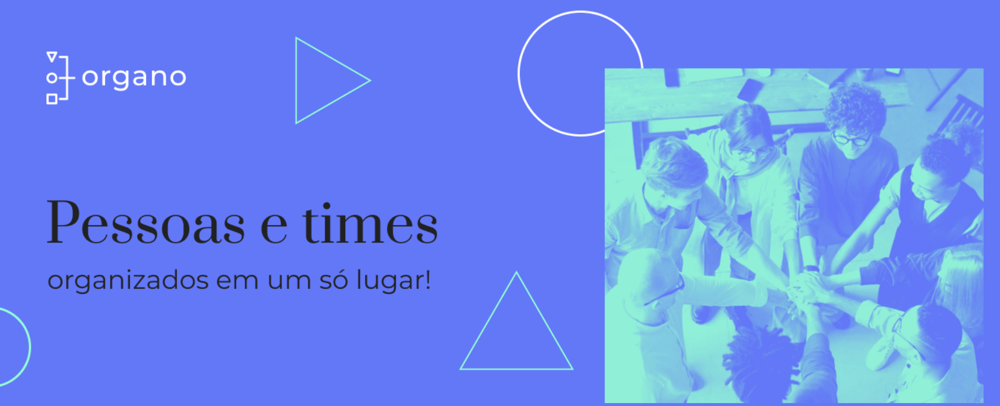
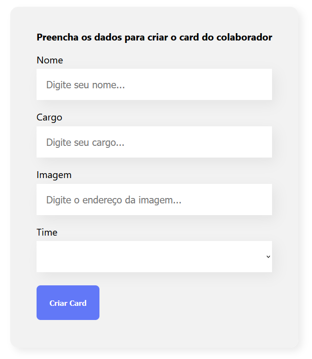
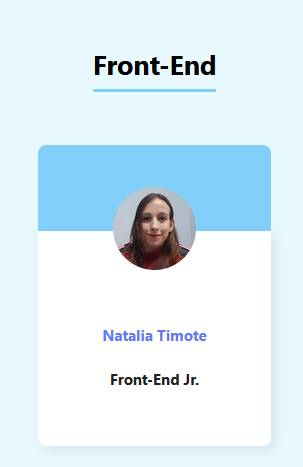

## 🏢 Organo

O **Organo** é uma aplicação desenvolvida em **React**, com o objetivo de **organizar os times de uma empresa**, permitindo adicionar nome, cargo, imagem e o time de cada colaborador. Esta versão do projeto foi **refatorada com TypeScript**, a partir de uma versão criada em um curso anterior da Alura, aprimorando a **tipagem, segurança e organização do código**.

 

## 🚀 Sobre o Projeto

Este projeto foi desenvolvido durante o curso da Alura:

* "React: migrando para TypeScript"
  
O **Organo** simula uma aplicação de organização corporativa, onde os colaboradores podem ser adicionados e exibidos de acordo com o time escolhido. Nesta versão, o foco foi **refatorar o projeto original em JavaScript para TypeScript**, aplicando **tipagem em props, state e funções**, garantindo maior confiabilidade, manutenção e clareza no código, sem alterar a funcionalidade existente.

## 📚 Objetivos do Curso

* Entender as principais diferenças entre **TS e JS**;
* Utilizar o **Intelisense do VSCode**;
* Experimentar as vantagens do TypeScript;
* Integrar **componentes React ao TypeScript**;
* Prototipar um plano de **migração de um projeto JS para TS**.

## 🛠️ Tecnologias Utilizadas

  

## 🖼️ Visualização do Projeto

Uma prévia das principais funcionalidades do **Organo**:

**🌐 Acesse o Projeto Online**

O projeto está disponível para visualização na **Vercel**. Clique no link abaixo para acessar:

**📌 Banner da Aplicação**

Área inicial que exibe o banner principal do Organo, trazendo destaque visual e identidade da aplicação.

**📨 Página do Projeto**

Página onde os colaboradores podem ser cadastrados, informando nome, cargo, imagem e time, sendo exibidos de forma organizada por grupo.

**👥 Times da Empresa**

Seção onde os colaboradores são exibidos de forma organizada por time, facilitando a visualização da equipe e o entendimento da estrutura da empresa.

